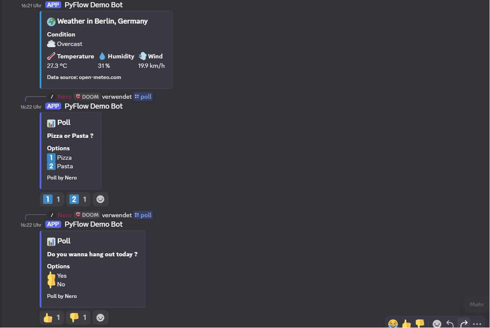
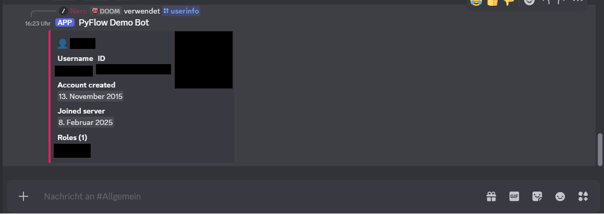

# Discord Bot

A small Discord bot in Python that I built as a starting point for community servers. It comes with
a handful of commands that are useful on almost any server, and it welcomes new members
automatically.

## What the bot does

- `/ping` shows the bot's response time.
- `/poll` creates a poll. Without options it becomes a simple Yes/No vote; with comma-separated
  options (up to ten) it becomes a numbered choice. The bot adds the voting reactions itself.
- `/weather` fetches the current weather for a city through the Open-Meteo API. No API key needed.
- `/userinfo` shows information about a member: account age, join date and roles.
- New members are greeted automatically with a short message when they join.

## A few commands in action



And the output of `/userinfo`:



## Installation

Requires Python 3.10 or newer.

```powershell
cd D:\Projects\discord-bot
python -m venv venv
.\venv\Scripts\Activate.ps1
pip install -r requirements.txt
```

On macOS or Linux use `source venv/bin/activate` instead.

## Creating the bot on Discord

You need a bot in the Discord Developer Portal once:

1. Create a new application at <https://discord.com/developers/applications>.
2. Under *Bot*, generate the token (*Reset Token*). That's the value for `DISCORD_BOT_TOKEN`.
3. A bit further down, enable the *Server Members Intent*. The bot needs it for the welcome message
   and for `/userinfo`.
4. Under *OAuth2 -> URL Generator* pick the scopes `bot` and `applications.commands`, and the
   permissions *Send Messages*, *Embed Links*, *Add Reactions* and *Read Message History*. Open the
   generated URL in the browser and invite the bot to your own server.

## Configuration

The settings live in a `.env` file so the token isn't in the code:

```powershell
copy .env.example .env
```

Then fill in the values in the `.env`:

| Variable | Required | Meaning |
| --- | --- | --- |
| `DISCORD_BOT_TOKEN` | yes | The bot token from the Developer Portal |
| `GUILD_ID` | no | ID of your own server. If set, the commands are available instantly, otherwise the global registration takes up to an hour. |
| `WELCOME_CHANNEL_ID` | no | Channel for the welcome message. Without it the bot uses the server's system channel. |

You get server and channel IDs by enabling Developer Mode in Discord (Settings -> Advanced) and then
right-clicking and choosing *Copy ID*.

## Running it

```powershell
python bot.py
```

If everything is set up, the bot reports in the terminal that it's logged in and that the commands
were registered.

## Layout

```
discord-bot/
  bot.py            the bot with all commands
  requirements.txt
  .env.example
  .gitignore
  README.md
```

## Notes

The token is read only from the `.env` and is excluded from the repository via `.gitignore`. The
weather data comes from Open-Meteo, which is usable without signup and without a key. The weather
lookup runs asynchronously via `aiohttp` so the bot doesn't block while it loads.
